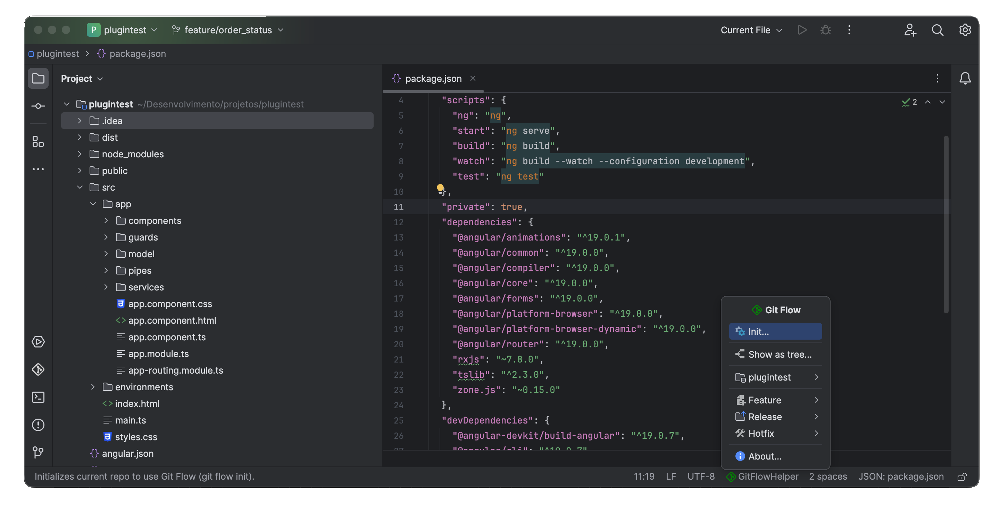

# GitFlow Helper

**GitFlow Helper** is an IntelliJ plugin that provides a complete and intuitive implementation of the **Git Flow** workflow, fully integrated into the IDE menus, status bar, and tool windows.

The plugin allows developers to work with Git Flow without relying on external tools or memorizing Git commands, offering a clean, menu-driven and IDE-native experience.

---

## ✨ Features

### 🌱 Git Flow Initialization

- Initialize Git Flow directly from IntelliJ.
- Configure all initial parameters, including:
    - `main` branch name
    - `develop` branch name
    - Prefixes for:
        - feature branches
        - release branches
        - hotfix branches
        - tags
- Configuration is stored and reused across all Git Flow operations.

---

### 🌳 Git Flow Branching Model

The plugin follows the standard Git Flow strategy:

- **Main branch**
    - Represents production-ready code.
- **Develop branch**
    - Integration branch for ongoing development.
- **Feature branches**
    - One branch per feature.
    - Created from `develop`.
    - Finished features are merged back into `develop`.
- **Release branches**
    - Used to prepare new production releases.
    - Allow stabilization and final adjustments.
- **Hotfix branches**
    - Created from `main` for urgent production fixes.
    - Merged back into both `main` and `develop`.

---

### 🏷️ Tag Generation

- Automatically creates Git tags when:
    - Finishing a release
    - Finishing a hotfix
- Tag naming follows Git Flow conventions.
- Ensures consistent and traceable versioning.

---

### 🔀 Branch Navigation

- Freely switch between branches directly from the plugin menus.
- Supports:
    - Local branches
    - Remote branches
- Smart checkout behavior:
    - Switches to an existing local branch when available
    - Automatically tracks and checks out remote branches when needed

---

### 📋 Menu-Based Workflow

- All Git Flow operations are available via IntelliJ menus.
- Each action corresponds to a specific Git Flow command.
- Menu items are context-aware and dynamically enabled or disabled to prevent invalid operations.

---

### 📍 Status Bar Integration

- The plugin is available directly from the **IntelliJ Status Bar**.
- Provides quick access to Git Flow actions without leaving the editor.
- Ideal for fast branch switching and common Git Flow operations.

---

### 🪟 Command Execution Tool Window

- Includes a dedicated **Tool Window** to monitor Git Flow execution.
- Displays:
    - Each Git command executed by the plugin
    - Command output (stdout)
    - Errors and failures (stderr)
- Allows developers to:
    - Track what is happening under the hood
    - Debug Git issues more easily
    - Maintain full transparency of operations

---

### 🛈 Built-in Help Descriptions

- Every menu item shows a **contextual help description** in the IntelliJ status bar footer.
- Descriptions explain:
    - What the action does
    - When it should be used
    - How it affects branches and tags
- This makes Git Flow easier to understand, even for beginners.

---

## 🛠️ Implementation Details

- Built using IntelliJ Platform APIs.
- Executes Git commands programmatically.
- Does not rely on external Git Flow CLI tools.
- Designed to be transparent, safe, and IDE-native.

---

## 📦 Repository

Source code available at:  
👉 https://github.com/walterdvalle/gitflow-helper
